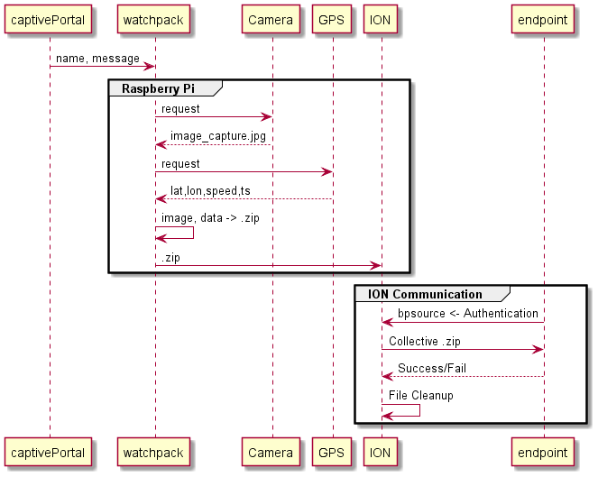

#### Required Hardware

Raspberry Pi 4 + USB-C Cable

Ethernet Cable

USB Wifi Dongle

1080p USB Webcam

Stemedu VK172 USB GPS Dongle

#### Install

Start with a fresh image - tested on 2020-12-02-raspios-buster-armhf

Etch the image to a microSD card

Add ssh or ssh.txt file to the boot directory

Insert microSD card, connect ethernet, power RPi

Discover the IP with any software like FING and SSH into the RPi on port 22

```
sudo raspi-config
5
L4
US
```

```
git clone https://github.com/Spatiam/Captive-Portal.git
```

```
sudo -i
```

```
sudo bash /home/pi/Captive-Portal/captiveportal.sh $0
```

RPi will reboot - IP Address may change

#### GPS and Monitoring

The watchpack service can be monitored with 

```
sudo journalctl -f -u watchpack.service --all
```

###### Sample GPS Data

```
$GPRMC,055910.00,A,3307.79227,N,09646.86076,W,0.147,,270121,,,D*66
$GPVTG,,T,,M,0.147,N,0.273,K,D*22
$GPGGA,055910.00,3307.79227,N,09646.86076,W,2,07,1.14,239.7,M,-25.3,M,,0000*6C
$GPGSA,A,3,19,05,46,25,02,29,12,,,,,,1.97,1.14,1.61*0D
$GPGSV,3,1,11,02,52,036,34,05,74,169,37,06,16,061,,09,03,042,*7A
$GPGSV,3,2,11,12,55,213,22,13,06,152,,19,11,113,08,25,46,286,40*77
$GPGSV,3,3,11,29,24,313,31,46,38,229,34,51,50,199,*40
$GPGLL,3307.79227,N,09646.86076,W,055910.00,A,D*7A
```

This data contains obscured values for time(GMT), date, latitude/longitude(DMS), speed(knots), true course, variation, and checksum values. The watchpack service is designed to parse this data live, make necessary conversions for the desired output units (DMS -> DD), and, listening for user messages, package GPS data, live images, and  user messages.

#### Additional

Below sites needs to be resolvable to public IPs for CP to work:

connectivitycheck.gstatic.com

www.gstatic.com

www.apple.com

captive.apple.com

clients3.google.com


Those IPs needs to be NATed to the pi (Network Address Translation) 

We intercept and modify the related network address headers as they route to the end-device


*It will be important when packaging this as a product to change the user/pass on the RPi - this will be added to the bash script when needed but will remain as the defaults for simplicity in testing


You can monitor the watchpack service using `sudo journalctl -f -u watchpack.service --all`

#### Troubleshooting

Install and capture traffic using `tcpdump -i wlan0 -w filename.pcap`

Check nginx logs

#### Other

```
# Go to /var/logs/
cd /var/logs/

# Find all gz files and extract them
find . -name '*.gz' -execdir gunzip '{}' \;

# Find MAC addresses in all files and dont show duplicates and other stuff
grep -hoiIs '[0-9A-F]\{2\}\(:[0-9A-F]\{2\}\)\{5\}' * | sort -u

NGINX logs
# Go to /var/logs/
cd /var/logs/nginx/

# Find all unique IP addresses that connected to the website. This will show 192...
grep -hoiIs -E '([0-9]{1,3}[\.]){3}[0-9]{1,3}' * | sort -u

# Find all unique IP addresses that connected to the website. This will show more details, like what (kind of) device connected.
grep -E '([0-9]{1,3}[\.]){3}[0-9]{1,3}' * | sort -u```

```

